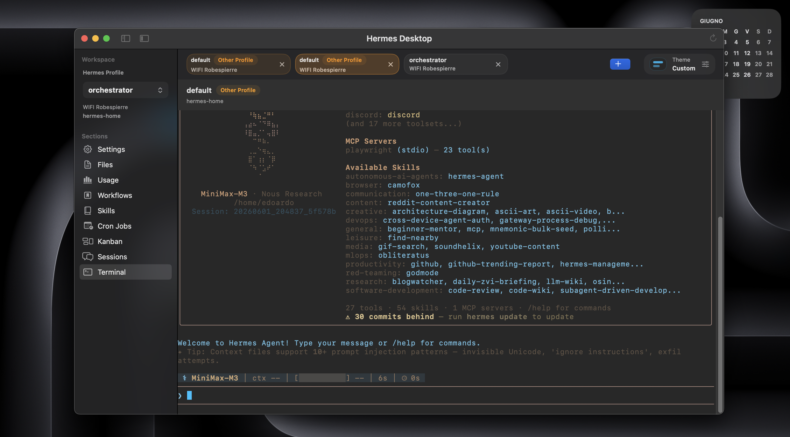
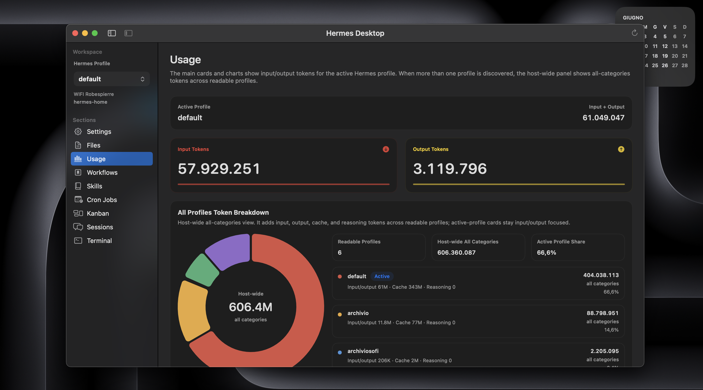
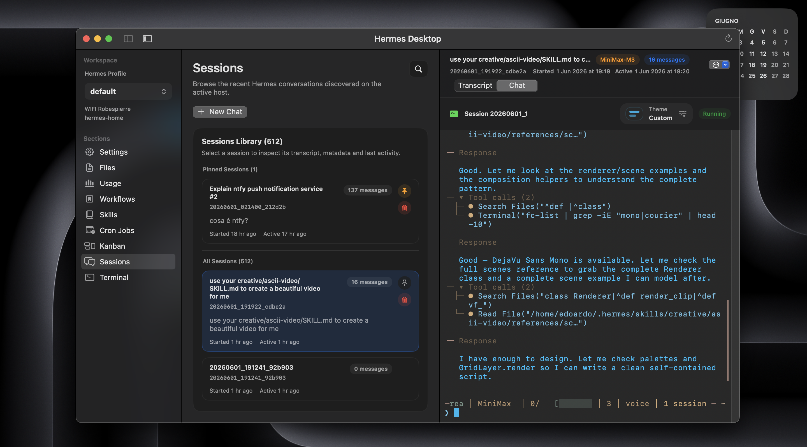

# Hermes Desktop — Tauri Cross-Platform Edition

Cross-platform fork of [Hermes Desktop](https://github.com/dodo-reach/hermes-desktop),
rebuilt with **Tauri 2 + Rust + TypeScript + Vite** to run on Linux, macOS, and
Windows instead of the original macOS-only SwiftUI app.

Same SSH-first workflow. Same Hermes host as source of truth. Now on every
desktop OS.

## What changed from upstream

The upstream project is a native SwiftUI Mac app (66 Swift sources, ~32 k lines).
This fork replaces the entire native layer:

| Layer | Upstream | This fork |
| --- | --- | --- |
| Desktop shell | SwiftUI + AppKit | **Tauri 2** (Rust backend + system WebView) |
| Backend | Swift services + Process | **Rust** services, SSH transport, remote Python payloads |
| Frontend | SwiftUI views | **TypeScript + HTML/CSS** rendered by Vite |
| Terminal | Vendored SwiftTerm | **xterm.js** with Rust streaming SSH TTY bridge |
| Packaging | Xcode archive / `build-macos-app.sh` | Tauri bundler: `.deb`, `.rpm`, `.dmg`, `.msi`, `.nsis` |
| CI | `macos-ci.yml` (Xcode) | `tauri-ci.yml` (Linux + macOS + Windows matrix) |

All Hermes features have been ported:

- **Connections** — SSH profile CRUD, SSH test, active host selection, legacy Swift data import
- **Overview** — remote Hermes workspace discovery, profile listing, path/cron/session-store info
- **Sessions** — remote session list/search/pin/transcript/delete, chat via Hermes TUI resume
- **Workflows** — local preset storage, skill assignment, Terminal and Chat/TUI launch
- **Kanban** — board discovery/load/archive, full task lifecycle, dependency editing, dispatcher, home-channel subscriptions
- **Files** — canonical Hermes files, workspace bookmarks, remote read/write with conflict checks, directory browser
- **Cron Jobs** — list/search/create/update/pause/resume/run-now/delete with locked atomic JSON writes
- **Usage** — token totals, top sessions/models, recent trends, multi-profile breakdown
- **Skills** — remote discovery, detail loading, create/update with conflict checks
- **Terminal** — live SSH TTY sessions via xterm.js, tabs, theme presets, bracketed-paste input, workflow/session handoff
- **Update checks** — GitHub Releases polling with 24-hour gate, manual check, release preview
- **Localization** — English, Russian, Simplified Chinese (reuses upstream `.lproj` resources)
- **Dark/Light theme** — default dark, persisted toggle, CSS variable system

## Preview

<table>
  <tr>
    <td width="50%">
      
    </td>
    <td width="50%">
      
    </td>
  </tr>
  <tr>
    <td width="50%">
      
    </td>
    <td width="50%">
      
    </td>
  </tr>
</table>

## Prerequisites

### All platforms

- [Node.js](https://nodejs.org/) **22+**
- [Rust](https://www.rust-lang.org/tools/install) **1.80+** (`rustup toolchain install stable`)
- `python3` available **on the Hermes host** (remote payloads need it)
- SSH access from this machine to the Hermes host, with the host key already accepted

### Linux (Debian / Ubuntu / Pop!_OS)

Tauri on Linux requires WebKit2GTK and related system libraries:

```bash
# One-liner:
bash scripts/install-tauri-linux-deps.sh

# Or manually:
sudo apt-get update
sudo apt-get install -y \
    libwebkit2gtk-4.1-dev \
    libgtk-3-dev \
    libayatana-appindicator3-dev \
    librsvg2-dev \
    libdbus-1-dev \
    patchelf
```

### macOS

- macOS **14+** recommended
- Xcode Command Line Tools: `xcode-select --install`
- No extra Homebrew packages required — Tauri uses the system WebKit

### Windows

- [Visual Studio C++ Build Tools](https://visualstudio.microsoft.com/visual-cpp-build-tools/) (Desktop development with C++ workload)
- [WebView2](https://developer.microsoft.com/en-us/microsoft-edge/webview2/) — pre-installed on Windows 10 (1803+) and Windows 11
- An SSH client on `PATH` (Windows 10+ ships OpenSSH; or use Git for Windows SSH)

## Quick start

```bash
# 1. Clone the repository
git clone https://github.com/<your-fork>/hermes-desktop.git
cd hermes-desktop

# 2. Install npm dependencies
npm install

# 3. Run in development mode (hot-reload frontend + Rust backend)
npm run tauri dev
```

The app opens a Tauri window with Vite hot-reload at `http://127.0.0.1:5173`.
Rust changes trigger an automatic backend rebuild.

## Development

### Project structure

```
hermes-desktop/
├── src/                      # TypeScript/HTML/CSS frontend
│   ├── main.ts               # Application entry, all UI modules
│   ├── styles.css             # Global styles, dark/light theme variables
│   ├── api.ts                 # Tauri invoke wrappers
│   ├── types.ts               # Shared TypeScript types
│   ├── i18n.ts                # Localization engine + dictionaries
│   └── update.ts              # GitHub Releases update checker
├── src-tauri/                 # Rust backend (Tauri 2)
│   ├── Cargo.toml             # Rust dependencies
│   ├── tauri.conf.json        # Tauri app configuration
│   └── src/
│       ├── main.rs            # Entry point
│       ├── lib.rs             # Tauri command surface + app setup
│       ├── models.rs          # Shared data models
│       ├── ssh.rs             # SSH transport layer
│       ├── remote_python.rs   # Remote Python payload wrapper
│       ├── storage.rs         # Local app data persistence
│       ├── connection.rs      # Connection profile management
│       ├── discovery.rs       # Remote Hermes workspace discovery
│       ├── session.rs         # Session browser service
│       ├── workflow.rs        # Workflow preset management
│       ├── kanban.rs          # Kanban board/task service
│       ├── file.rs            # Remote file editor service
│       ├── cron.rs            # Cron job management service
│       ├── usage.rs           # Usage analytics service
│       ├── skill.rs           # Skills catalog service
│       ├── terminal.rs        # Live SSH TTY bridge
│       └── error.rs           # Error types
├── scripts/
│   ├── install-tauri-linux-deps.sh   # Linux system dependency installer
│   └── check-i18n.mjs               # Localization coverage checker
├── index.html                 # Vite entry HTML
├── vite.config.ts             # Vite configuration
├── package.json               # npm scripts and dependencies
└── .github/workflows/
    └── tauri-ci.yml           # Cross-platform CI (Linux + macOS + Windows)
```

### npm scripts

| Command | Description |
| --- | --- |
| `npm run dev` | Start Vite dev server (frontend only) |
| `npm run build` | TypeScript check + Vite production build |
| `npm run tauri dev` | Full Tauri dev mode (frontend + Rust backend, hot-reload) |
| `npm run tauri:build` | Build Tauri bundle for the current platform (all bundle types) |
| `npm run tauri:build:linux` | Build `.deb` and `.rpm` bundles |
| `npm run tauri:build:macos` | Build `.dmg` bundle |
| `npm run tauri:build:windows` | Build `.msi` and `.nsis` installers |
| `npm run test:i18n` | Verify localization key parity across all locales |
| `npm run release -- 0.10.4 --push` | Bump all app versions, run release checks, commit, tag, and push the tag for CI release |
| `npm run test:smoke:ssh` | Run read-only SSH smoke tests against a real Hermes host |
| `npm run test:smoke:ssh:mutations` | Run disposable mutation smoke tests against a real host |

## Building for production

### Linux

```bash
# Install system dependencies (first time only)
bash scripts/install-tauri-linux-deps.sh

# Build .deb and .rpm
npm run tauri:build:linux
```

Output:
```
src-tauri/target/release/bundle/deb/hermes-desktop_*.deb
src-tauri/target/release/bundle/rpm/hermes-desktop-*.rpm
```

Install the `.deb`:
```bash
sudo dpkg -i src-tauri/target/release/bundle/deb/hermes-desktop_*.deb
```

Install the `.rpm`:
```bash
sudo rpm -i src-tauri/target/release/bundle/rpm/hermes-desktop-*.rpm
```

### macOS

```bash
npm run tauri:build:macos
```

Output:
```
src-tauri/target/release/bundle/dmg/Hermes Desktop_*.dmg
```

Open the `.dmg`, drag `Hermes Desktop.app` to `Applications`.

> [!NOTE]
> The current build is ad-hoc signed and not notarized. macOS may show a
> first-launch warning. Right-click → Open, or go to System Settings →
> Privacy & Security → Open Anyway.

### Windows

```bash
npm run tauri:build:windows
```

Output:
```
src-tauri\target\release\bundle\msi\Hermes Desktop_*.msi
src-tauri\target\release\bundle\nsis\Hermes Desktop_*-setup.exe
```

Run the `.msi` installer or the NSIS setup executable.

> [!NOTE]
> Windows builds require Visual Studio C++ Build Tools and WebView2 runtime.
> WebView2 is pre-installed on Windows 10 (1803+) and all Windows 11 versions.

## Testing

### Automated tests

```bash
# Frontend type checking + build
npm run build

# Localization coverage
npm run test:i18n

# Rust unit tests (36 tests: storage, SSH, remote payloads, terminal, workflows)
cargo test --manifest-path src-tauri/Cargo.toml

# Rust formatting check
cargo fmt --manifest-path src-tauri/Cargo.toml -- --check

# Rust type check
cargo check --manifest-path src-tauri/Cargo.toml
```

### SSH smoke tests (require a real Hermes host)

Read-only smoke — tests discovery, sessions, files, usage, skills, cron, kanban:

```bash
HERMES_SMOKE_HOST=your-host \
HERMES_SMOKE_USER=your-user \
HERMES_SMOKE_HOME='~/.hermes' \
npm run test:smoke:ssh
```

Disposable mutation smoke — creates temporary resources under `.tauri-smoke`,
then cleans up:

```bash
HERMES_SMOKE_HOST=your-host \
HERMES_SMOKE_USER=your-user \
HERMES_SMOKE_HOME='~/.hermes' \
HERMES_SMOKE_MUTATIONS=1 \
npm run test:smoke:ssh:mutations
```

Optional env vars: `HERMES_SMOKE_PORT`, `HERMES_SMOKE_PROFILE`.

## CI/CD

The GitHub Actions workflow at `.github/workflows/tauri-ci.yml` runs on every
push, pull request, and manual dispatch.

### Matrix

| Platform | Runner | Bundle output |
| --- | --- | --- |
| Linux | `ubuntu-22.04` | `.deb`, `.rpm`, `.AppImage` |
| macOS | `macos-latest` | `.dmg` |
| Windows | `windows-latest` | `.msi`, `.nsis` |

### CI steps (per platform)

1. Checkout repository
2. Install Linux system dependencies (Linux only)
3. Install Rust stable toolchain
4. Setup Node.js 22 with npm cache
5. `npm ci`
6. `npm run test:i18n` — localization parity
7. `npm run build` — frontend TypeScript + Vite
8. `cargo fmt --check` — Rust formatting
9. `cargo check` — Rust compilation
10. `cargo test` — Rust unit tests
11. Platform-specific Tauri bundle build
12. Upload bundle artifacts

Build artifacts are attached to each CI run and can be downloaded from the
GitHub Actions summary page.

### Release process

Use the release script so app versions, commits, tags, and release notes stay in sync:

```bash
npm run release -- 0.10.4 --push
```

The script updates `package.json`, `package-lock.json`, `src-tauri/Cargo.toml`,
`src-tauri/Cargo.lock`, and `src-tauri/tauri.conf.json`, then runs localization,
frontend, Rust formatting, Rust check, and Rust test gates before creating an
annotated tag. Pushing the tag starts the existing GitHub Actions release job;
do not create GitHub Releases manually before CI artifacts are ready.

## Configuration

### Tauri app configuration

The main Tauri configuration is in
[`src-tauri/tauri.conf.json`](src-tauri/tauri.conf.json):

- **Product name**: `Hermes Desktop`
- **App identifier**: `app.hermes.desktop`
- **Window**: 1320×860 default, 980×640 minimum, resizable
- **Bundles**: `.deb`, `.rpm`, `.dmg`, `.msi`, `.nsis` (platform-dependent)
- **Category**: Developer Tool

### Local app data locations

| Platform | Path |
| --- | --- |
| Linux | `~/.local/share/app.hermes.desktop/` |
| macOS | `~/Library/Application Support/app.hermes.desktop/` |
| Windows | `%APPDATA%\app.hermes.desktop\` |

Stored data: `connections.json`, `preferences.json`, workflow presets, pinned
sessions, bookmarked files.

On macOS, the Tauri app automatically imports legacy Swift app data from
`~/Library/Application Support/HermesDesktop/` when Tauri files are missing.

## Architecture

```
┌──────────────────────────────────────────────────┐
│                   Tauri Window                   │
│  ┌────────────────────────────────────────────┐  │
│  │         TypeScript + HTML/CSS              │  │
│  │  Vite HMR │ xterm.js │ i18n │ Update UI   │  │
│  └────────────────┬───────────────────────────┘  │
│                   │ Tauri IPC (invoke)            │
│  ┌────────────────┴───────────────────────────┐  │
│  │              Rust Backend                  │  │
│  │  SSH Transport │ Remote Python Payloads    │  │
│  │  Storage │ Connection │ Discovery │ ...    │  │
│  └────────────────┬───────────────────────────┘  │
└───────────────────┼──────────────────────────────┘
                    │ SSH (system `ssh` binary)
                    ▼
            ┌───────────────┐
            │  Hermes Host  │
            │  ~/.hermes    │
            │  python3      │
            └───────────────┘
```

The Rust backend executes commands on the Hermes host over SSH using the
system `ssh` binary. Remote operations are wrapped in generated Python
payloads that run on the host and return structured JSON. The frontend
communicates with the Rust backend through Tauri's IPC invoke mechanism.

## Differences from the Swift app

| Feature | Swift app | Tauri app |
| --- | --- | --- |
| Platform | macOS only | Linux, macOS, Windows |
| Terminal | SwiftTerm (native) | xterm.js (web-based) |
| Theme | System macOS appearance | Built-in dark/light toggle |
| Keyboard shortcuts | macOS Cmd+… | Platform-adaptive Cmd/Ctrl+… |
| Packaging | `.app` bundle + zip | `.deb`, `.rpm`, `.dmg`, `.msi`, `.nsis` |
| Code signing | Ad-hoc macOS signing | Not yet (deferred) |
| Auto-update | GitHub Releases check | GitHub Releases check (same) |

## Troubleshooting

### Linux: WebKit2GTK not found

```
error: could not find system library 'webkit2gtk-4.1'
```

Install the required packages:
```bash
bash scripts/install-tauri-linux-deps.sh
```

### macOS: Gatekeeper blocks the app

Right-click `Hermes Desktop.app` → Open → Confirm. Or: System Settings →
Privacy & Security → Open Anyway.

### Windows: WebView2 missing

Download and install [WebView2 Runtime](https://developer.microsoft.com/en-us/microsoft-edge/webview2/)
from Microsoft. Already included on Windows 10 (1803+) and Windows 11.

### Windows: SSH not found

Ensure OpenSSH is on your `PATH`. Windows 10+ includes OpenSSH as an optional
feature: Settings → Apps → Optional Features → OpenSSH Client.

Alternatively, add Git for Windows SSH to your PATH.

### Rust compilation errors

Ensure Rust 1.80+ is installed:
```bash
rustup update stable
rustup default stable
```

### Python payload tests fail

The `cargo test` suite includes tests that compile generated Python payloads
with `python3 -m py_compile`. Ensure `python3` is available locally for these
tests to pass.

## License

[MIT](LICENSE)

## Related documentation

- [README.md](README.md) — Original upstream project documentation
